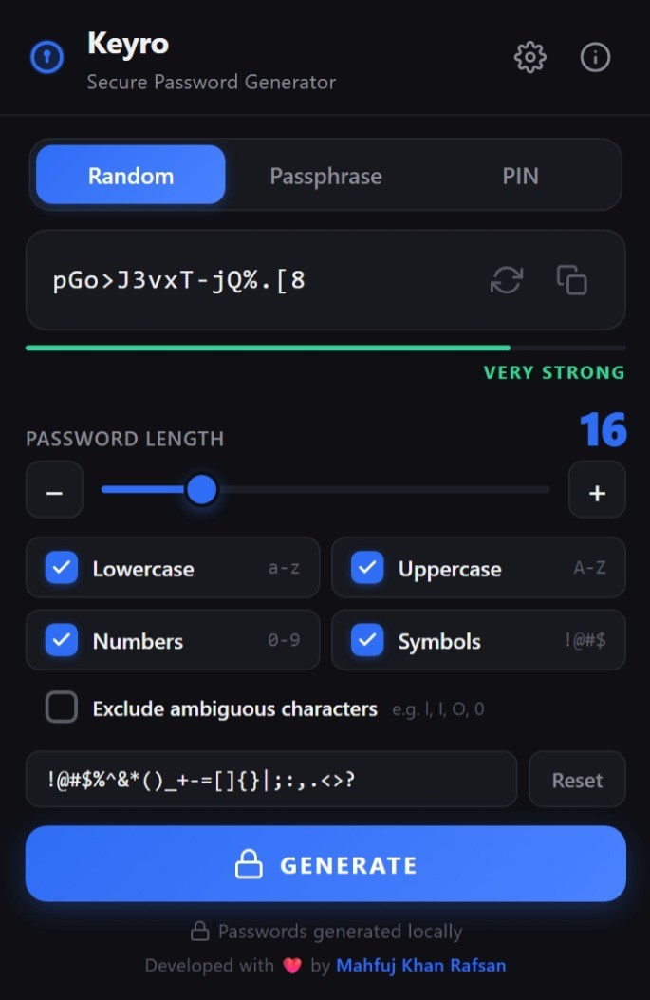
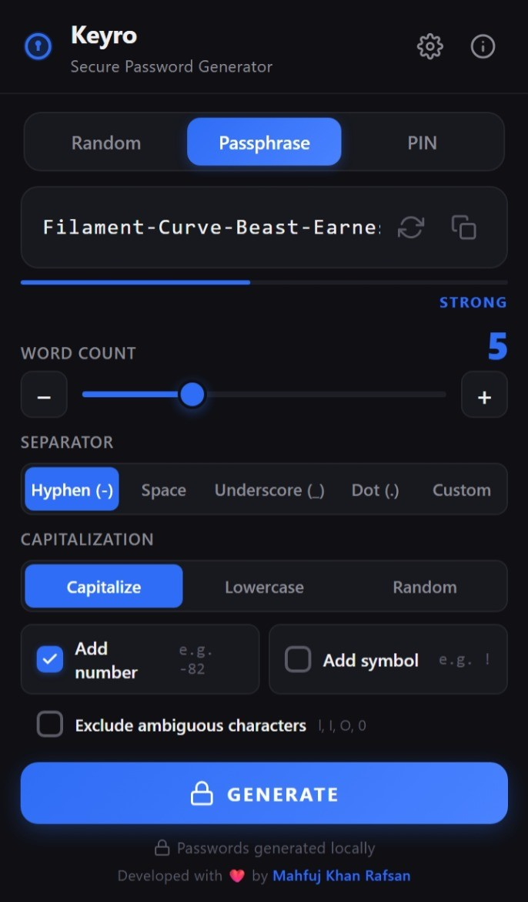
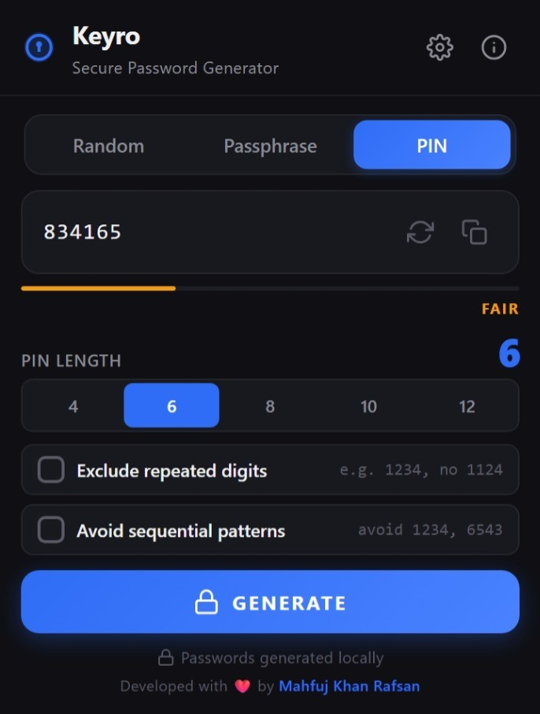
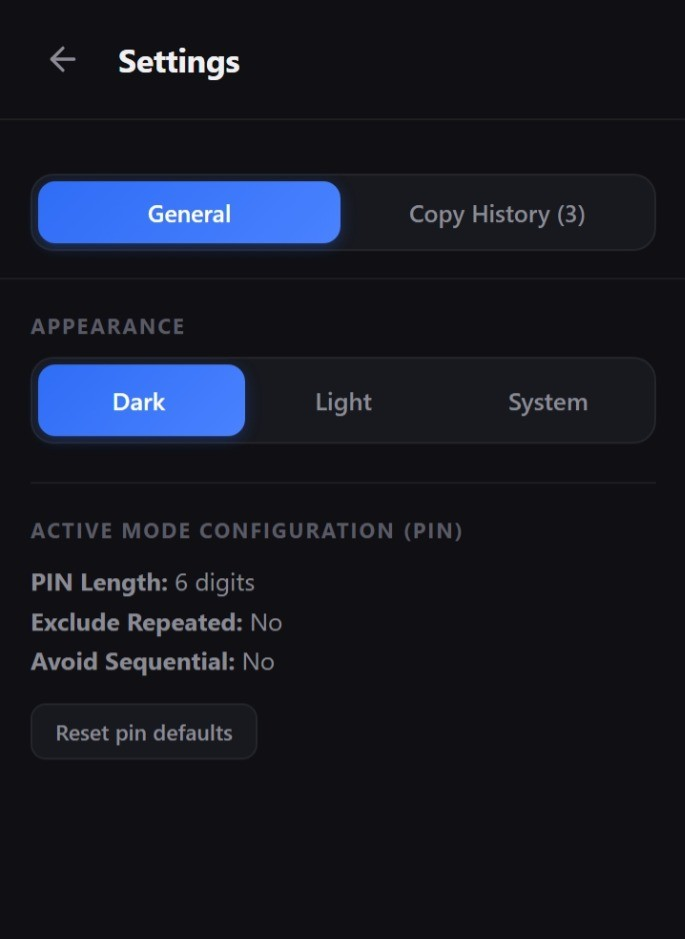
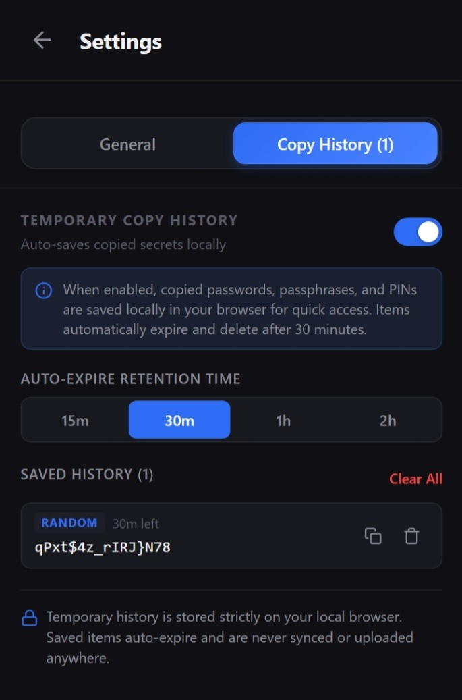

# Keyro - Secure Password, Passphrase & PIN Generator

<div align="center">


### 🔐 Privacy-First, 100% Offline Credential Generator for Chromium Browsers


[](https://github.com/mahfujkn/keyro/releases)

[**Download Release (.ZIP)**](https://github.com/mahfujkn/keyro/releases) • [**Features**](#-key-features) • [**Installation**](#-quick-installation-from-github-release-zip) • [**Screenshots**](#-screenshots)
</div>

---

## 📖 Overview

**Keyro** is a modern, privacy-first browser extension for generating secure passwords, memorable passphrases, and numeric PINs directly in your Chromium-based browser (Google Chrome, Microsoft Edge, Brave, etc.).

Built with **React 18, TypeScript, Vite, and the Web Crypto API**, Keyro performs all credential generation entirely on your local device. There are no accounts, cloud servers, analytics, external APIs, or network calls involved in normal operation.

Cryptographic randomness is generated locally using `crypto.getRandomValues()` with rejection sampling, helping avoid statistical modulo bias associated with naive random selection.

---

## ✨ Key Features

- 🔐 **Cryptographically Secure Generation**: Uses the Web Crypto API and `crypto.getRandomValues()` with rejection sampling instead of `Math.random()`.
- 🎛️ **Three Powerful Generation Modes**:
  - **Random Password Mode**: Customizable length from 4–64 characters, with lowercase, uppercase, numbers, symbols, custom symbol sets, and ambiguous character exclusion (`O`, `0`, `I`, `l`, `1`).
  - **Passphrase Mode**: Generates memorable multi-word passphrases using 3–10 words with customizable separators (`-`, ` `, `_`, `.`, custom), capitalization styles, optional numbers, and symbols.
  - **PIN Mode**: Generates secure 4, 6, 8, 10, or 12-digit PINs with unique-digit enforcement and sequential pattern rejection such as `1234`, `6543`, and `1111`.
- 🕒 **Optional Temporary Copy History**:
  - **Privacy First**: Disabled by default.
  - **Local Storage Only**: Auto-saves copied credentials locally for a customizable duration (15m, 30m, 1h, 2h).
  - **Full Management**: Re-copy or delete any item anytime, or clear all history with one click.
  - **Auto Expire**: Expired items are automatically pruned and deleted from local storage.
- 🗂️ **Tabbed Settings Navigation**:
  - **General Tab**: Appearance controls and active generator mode configuration.
  - **Copy History Tab**: Switch toggle, auto-expire retention selector, history list, and privacy note.
- 🎨 **Material Design Dark & Light UI**:
  - Responsive and compact interface.
  - Dark, Light, and System theme support.
  - Clean Material Design-inspired visual language.
- 🔒 **100% Offline & Private**: Zero accounts, zero tracking, zero cloud storage, and zero network calls.
- 📋 **One-Click Clipboard Copy**: Quickly copy generated credentials with visual confirmation (`Copied ✓`).
- ♿ **Accessibility Focused**:
  - ARIA attributes.
  - Visible keyboard focus rings.
  - Full keyboard navigation.
  - `prefers-reduced-motion` support.
- 🧪 **Tested Core Logic**: Vitest unit test suite with 49 passing tests.

---

## 📸 Screenshots

<div align="center">

### 1. Random Password Mode


---

### 2. Passphrase Mode


---

### 3. PIN Mode


---

### 4. Settings Panel (General)


---

### 5. Settings Panel (Temporary Copy History)


</div>

---

## 🚀 Quick Installation (From GitHub Release ZIP)

No coding or build tools are required. Install the pre-built extension in a few simple steps:

1. Go to [**Keyro GitHub Releases**](https://github.com/mahfujkn/keyro/releases) and download the latest `keyro-v2.0.0-extension.zip`.
2. Extract / Unzip the downloaded `keyro-v2.0.0-extension.zip` file to a folder on your computer.
3. Open your Chromium-based browser:
   - **Google Chrome / Brave**: navigate to `chrome://extensions/`
   - **Microsoft Edge**: navigate to `edge://extensions/`
4. Enable **Developer mode** in the top-right corner.
5. Click **Load unpacked** and select the unzipped extension folder.
6. 🎉 **Keyro** is now installed and ready to use. Click the **Keyro** icon in your browser toolbar to start generating secure credentials instantly.

---

## 📜 Wordlist License Notice

Keyro bundles the **EFF Short Wordlist 1**, containing 1,296 curated words created by the Electronic Frontier Foundation (EFF).

| Item | Details |
| :--- | :--- |
| **Wordlist** | EFF Short Wordlist 1 |
| **Word Count** | 1,296 curated words |
| **License** | Public Domain (CC0 / Public Domain Dedication) |
| **Source** | [Electronic Frontier Foundation (EFF) DiceWords](https://www.eff.org/dice) |
| **Storage** | Statically compiled into the extension bundle |
| **Network Usage** | Zero network calls |

---

## 🛠️ Tech Stack & Architecture

| Component | Technology |
| :--- | :--- |
| **Core Logic** | TypeScript, Web Crypto API |
| **UI Framework** | React 18, Custom CSS Custom Properties |
| **Design System** | Material Design aesthetic |
| **Build System** | Vite 8, Rollup |
| **Testing** | Vitest (49 unit tests passing) |
| **Extension Format** | Chrome Manifest V3 |

### Project Structure

```text
keyro/
├── docs/screenshots/       # Extension UI screenshots (5 high-res previews)
├── public/                 # Manifest V3 configuration & icons
├── src/
│   ├── lib/                # Core generator modules (passphrase, pin, generator, strength, wordlist, storage)
│   ├── hooks/              # Custom React hooks (useGenerator, useTheme)
│   ├── popup/              # React UI components & styles
│   └── types/              # Shared TypeScript definitions
├── tests/                  # Vitest unit test suite (49 passing tests)
├── keyro-v2.0.0-extension.zip # Pre-built release package
├── popup.html              # Main extension entry HTML
├── vite.config.ts          # Vite build configuration
└── package.json
```

---

## 💻 Building From Source

### Prerequisites

- [Node.js](https://nodejs.org/) (v18 or higher recommended)
- `npm` or `yarn`

### Build Steps

1. **Clone the repository**

   ```bash
   git clone https://github.com/mahfujkn/keyro.git
   cd keyro
   ```

2. **Install dependencies**

   ```bash
   npm install
   ```

3. **Run the unit test suite**

   ```bash
   npm run test
   ```

4. **Build the production extension**

   ```bash
   npm run build
   ```

   The compiled extension will be generated in the `dist/` directory.

---

## 👨‍💻 Author & Developer

Developed with ❤️ by **[Mahfuj Khan Rafsan](https://github.com/mahfujkn)**

- **GitHub Profile**: [@mahfujkn](https://github.com/mahfujkn)
- **Project Repository**: [mahfujkn/keyro](https://github.com/mahfujkn/keyro)

---

## 📄 License

This project is licensed under the **MIT License** — see the [LICENSE](LICENSE) file for details.
