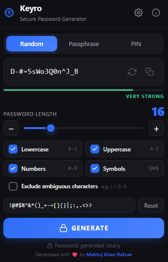
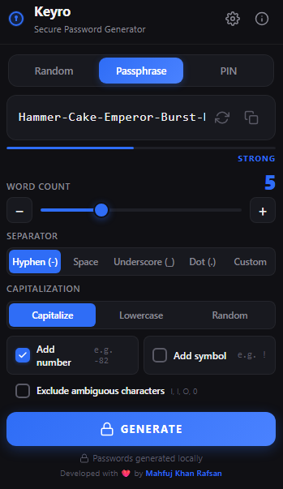
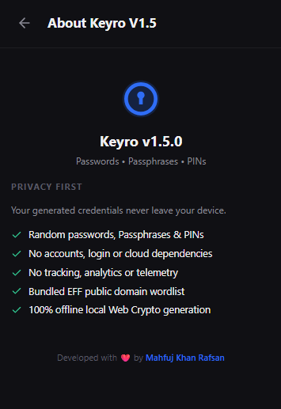

# 🔑 Keyro - Secure Password, Passphrase & PIN Generator


**Keyro** is a modern, privacy-first secure password, passphrase, and PIN generator browser extension for Chromium browsers (Google Chrome, Microsoft Edge, Brave, etc.). Built with React 18, TypeScript, and Vite, Keyro runs 100% locally in your browser using the Web Crypto API without any external dependencies, analytics, backend servers, or cloud storage.

Developed with ❤️ by **[Mahfuj Khan Rafsan](https://github.com/mahfujkn)**

---

## 📸 Screenshots

| Random Password Mode | Passphrase Mode | About Panel |
| :---: | :---: | :---: |
|  |  |  |

---

## ⚡ Quick Installation (From GitHub Release ZIP)

No coding or build tools required! Follow these 4 simple steps:

1. **Download**: Go to [Keyro GitHub Releases](https://github.com/mahfujkn/keyro/releases) and download the latest `keyro-v1.5.0-extension.zip`.
2. **Extract**: Unzip the downloaded `keyro-v1.5.0-extension.zip` file on your computer.
3. **Open Extensions Page**:
   - Google Chrome / Brave: Navigate to `chrome://extensions/`
   - Microsoft Edge: Navigate to `edge://extensions/`
4. **Load Extension**:
   - Enable **Developer mode** (toggle in the top-right corner).
   - Click **Load unpacked** and select the unzipped extension folder.
   - 🎉 Done! Click the **Keyro** icon in your browser toolbar to start generating secure credentials instantly!

---

## 🌟 Key Features

- 🔐 **Web Crypto API**: Cryptographically secure random generation via `crypto.getRandomValues()` with rejection sampling (zero `Math.random()` bias).
- 🎛️ **3 Generation Modes**:
  - **Random Password Mode**: Customizable length (4–64), lowercase, uppercase, numbers, symbols, custom symbol sets, and ambiguous character exclusion (`O`, `0`, `I`, `l`, `1`).
  - **Passphrase Mode**: Memorable multi-word passphrases (3–10 words) with customizable separators (`-`, ` `, `_`, `.`, custom), capitalization styles, optional appended numbers and symbols.
  - **PIN Mode**: Secure numeric PINs (4, 6, 8, 10, 12 digits) with unique digit enforcement and sequential pattern rejection (`1234`, `6543`, `1111`).
- 🎨 **Material Design Dark & Light UI**: Responsive, compact interface supporting Dark, Light, and System themes.
- 🔒 **100% Offline & Private**: Zero accounts, zero tracking, zero cloud storage, zero network calls.
- 📋 **One-Click Clipboard Copy**: Fast copy with visual confirmation (`Copied ✓`).
- ♿ **Full Accessibility**: ARIA attributes, visible focus rings, keyboard navigation, and `prefers-reduced-motion` compliance.

---

## 📂 Wordlist License Notice

Keyro bundles the **EFF Short Wordlist 1** (1,296 curated words) created by the Electronic Frontier Foundation (EFF).
- **License**: Public Domain (CC0 / Public Domain Dedication).
- **Source**: [Electronic Frontier Foundation (EFF) DiceWords](https://www.eff.org/dice)
- Words are statically compiled into the extension bundle — zero network calls are made.

---

## 🛠️ Tech Stack & Architecture

- **Core Logic**: TypeScript, Web Crypto API
- **UI Framework**: React 18, Custom CSS Custom Properties (Material Design aesthetic)
- **Build System**: Vite 8, Rollup
- **Testing**: Vitest (46 unit tests passing)
- **Extension Format**: Chrome Manifest V3

### Project Structure
```text
keyro/
├── docs/screenshots/       # Extension UI screenshots
├── public/                 # Manifest V3 configuration & icons
├── src/
│   ├── lib/                # Core generator modules (passphrase, pin, generator, strength, wordlist)
│   ├── hooks/              # Custom React hooks (useGenerator, useTheme)
│   ├── popup/              # React UI components & styles
│   └── types/              # Shared TypeScript definitions
├── tests/                  # Vitest unit test suite
├── keyro-v1.5.0-extension.zip # Pre-built release package
├── popup.html              # Main extension entry HTML
├── vite.config.ts          # Vite build configuration
└── package.json
```

---

## 💻 Building From Source

### Prerequisites
- [Node.js](https://nodejs.org/) (v18 or higher recommended)
- `npm` or `yarn`

### Building Steps

1. Clone the repository:
   ```bash
   git clone https://github.com/mahfujkn/keyro.git
   cd keyro
   ```

2. Install dependencies:
   ```bash
   npm install
   ```

3. Run unit test suite:
   ```bash
   npm run test
   ```

4. Build the production extension:
   ```bash
   npm run build
   ```
   The compiled extension will be generated in the `dist/` directory.

---

## 👨‍💻 Author

Developed with ❤️ by **Mahfuj Khan Rafsan**
- GitHub: [@mahfujkn](https://github.com/mahfujkn)
- Repository: [mahfujkn/keyro](https://github.com/mahfujkn/keyro)

---

## 📄 License

This project is licensed under the MIT License - see the [LICENSE](LICENSE) file for details.
